# Project Nosh – Technical Spec

> **Phone-first application.** Every screen is designed and built for small phones first (including older ones), then scaled up for desktop. Test on a phone-sized viewport before anything else.

## Stack

| Layer    | Choice                       |
|----------|------------------------------|
| Backend  | Python, FastAPI, served by Uvicorn |
| Tooling  | uv (dependencies, virtualenv, running) |
| Database | SQLite                       |
| Frontend | React + Vite (TypeScript)    |

## Architecture

Layered app that runs locally:

```
React (Vite)  →  FastAPI (REST/JSON)  →  SQLite
```

- The frontend talks to the API only over HTTP; it has no direct DB access.
- Single user, so no auth.
- Starter recipes are seeded from `backend/data/project-nosh-sample-recipes.json` on first run (only when the DB is empty, via SQLModel).

## Backend architecture (layers)

```
api/           routers: URLs, status codes, request/response schemas (app/schemas.py). No DB access
services/      business rules (slugs, tags, scaling, shopping-list rebuild); raise domain errors, no HTTP
repositories/  the only code that queries the database
models.py      SQLModel tables
core/          config (env vars), logging, request ids, errors, middleware, OpenAPI
```
- Dependencies point down only; `tests/test_architecture.py` enforces it.
- `create_app()` factory wires logging → middleware → error handlers → routers.

**Errors:** every failure returns `{"error": {"code", "message", "details"?, "requestId"}}`.
- Services raise `NotFoundError` (404), `ConflictError` (409), `ValidationFailed` (422, `details.fields`), with specific codes (`recipe_not_found`, `recipe_name_taken`…).
- Request validation errors use the same shape, with camelCase field paths.
- Unexpected errors return a generic 500 message; the stack trace is logged with the request id and never sent to the client.
- The frontend's `ApiError` / `ValidationError` mirror this; `errorMessage()` shows "(ref <requestId>)" for 500s.

**Logging:** one format for the app and Uvicorn, with the request id on every line, e.g. `2026-10-07 12:00:00,123 INFO app.access [a1b2c3] GET /api/recipes 200 12ms`. Level via `NOSH_LOG_LEVEL`. `X-Request-ID` is accepted if safe, otherwise generated, and echoed on every response.

**API contract = OpenAPI:** `app/schemas.py` (`CONTRACT_MODELS`) → `/api/openapi.json` → exported to `backend/openapi.json` (`uv run python -m app.export_openapi`; a test fails if stale) → frontend `npm run gen:api` → `src/api/schema.gen.ts`. Data shapes are never hand-written on the frontend. Endpoint paths are listed in `frontend/src/api/endpoints.ts` until each endpoint exists in the backend.

### Recipes API notes
- **Efficiency:** related rows load up front with `selectinload` (fixed query count, no N+1; `tests/api/test_query_efficiency.py` guards it). Filters run in SQL; the list loads summaries only.
- **SQLite 3.51.0 bug found by tests:** correlated `EXISTS (... label IN (...))` returned duplicate rows. Filters use `recipe.id IN (SELECT recipe_id ...)` instead, with a regression test.
- **Scaling on the recipe view** (`services/scaling.py`): g/ml → whole numbers; kg/l → 2 decimals; tsp/tbsp/tin/ball/thumb/handful → nearest ½ (min ½); counted items, cloves, slices, rashers → round up; "to taste" unscaled. Shopping list rounding (packs up) comes later.
- **Tests:** `tests/unit` = pure rules + services with mocked repositories (typed model objects, no DB); `tests/api` = full HTTP flows on a fresh seeded DB per test (fixtures `client`, `session`, `count_queries`).

### Sync vs async (demo talking point)

**Current choice: synchronous services and DB access, on purpose.**
- The DB driver (SQLAlchemy + Python's `sqlite3`) is synchronous. FastAPI runs plain `def` routes in a thread pool, so a slow query doesn't block other requests.
- Making services `async` while still calling a sync driver would **block the event loop** and make things slower. That's a common mistake.
- With SQLite and a single user, async gives little real gain: SQLite serialises writes anyway.

**How we'd go async (when scaling, e.g. moving to Postgres):**
| Layer | Change |
|---|---|
| Driver & engine | `aiosqlite` (or `asyncpg` for Postgres) + SQLAlchemy async engine + SQLModel `AsyncSession` |
| Repositories | `async def`, `await session.exec(...)` |
| Services | `async def` where they touch the DB (await repositories) |
| Routers | `async def` |
| Startup seeding & tests | async (`pytest-anyio`, async test client) |

- **Stays sync:** pure CPU logic (slugify, ingredient merge keys, unit conversion, servings scaling). `async` adds overhead there for no benefit.
- **Watch out:** async SQLAlchemy can't lazy-load relationships, so repositories load them explicitly (`selectinload`). That's cleaner anyway, with no hidden queries.
- The layered structure makes this a contained change: routers, services and repositories change signatures, but the rules, schemas and error handling don't.

## Project layout

```
backend/    FastAPI app (uv project, pyproject.toml)
frontend/   React + Vite app
```

## Quick start

Goal: anyone can clone the repo and run it in a few commands.

```bash
# Backend
cd backend
uv sync
uv run uvicorn app.main:app --reload

# Frontend
cd frontend
npm install
npm run dev
```

## Best practices

### Git workflow
- One local branch per task (e.g. `feature/shopping-list`, `fix/unit-merge`), merged into `main` when done.
- Before starting work that may be a new feature, ask before creating the branch.
- Branches can be pushed to GitHub later and opened as PRs; push and open each PR before merging locally, or it will show no changes.

- Commit messages and PR descriptions have **no "Co-Authored-By: Claude" or AI attribution lines**.

### Data
- Never modify the recipe JSON (`backend/data/project-nosh-sample-recipes.json`). Read it as-is; handle any data quirks in code or UI, not by editing the file.

### Security & sensitive data
- Never commit secrets. API keys (e.g. the Claude API key for the AI helper) go in `backend/.env`, loaded by the backend only and never sent to the frontend. Commit a `backend/.env.example` with empty values.
- `.gitignore` covers `.env*` (except `.env.example`), `*.pem`, `*.key`, `*.p12`, `*.pfx`, `secrets/`, `credentials*.json`, databases, uploads and logs.
- Before pushing anywhere, scan history for secrets. Last scan (all branches, 25 commits): clean.
- **Before making the repo public:** remove the candidate-pack PPT from history (it's in commit `c1605fc`, "© Enablis"), and decide on the commit author email (currently a work address).

### Docs
- Keep `README.md` run instructions up to date whenever infra or setup changes.

## Mobile & older phones

It's a web app, so it runs in any browser (laptop or phone) with no install. The brief requires it to work well on older, smaller phones.

- **Mobile-first layout:** design for small screens first (mockup is 390px wide; also test at ~320–360px), then scale up to desktop.
- **Lightweight:** keep the bundle small and dependencies minimal for slow phones and connections.
- **Older browsers:** `@vitejs/plugin-legacy` is installed. `npm run build` outputs a modern bundle plus a legacy bundle with polyfills; each browser loads what it supports. Only applies to the production build (`npm run build && npm run preview -- --host`), not `npm run dev`. Worth mentioning in the demo: "works on both new and old phones".
- **Accessibility:** WCAG AA contrast and tap targets of at least 44px.

### Demo on a phone

1. Connect the laptop and phone to the same Wi-Fi.
2. Run the backend as normal (`uv run uvicorn app.main:app --reload`).
3. Run the frontend exposed on the network: `npm run dev -- --host`.
4. Vite prints a `Network:` URL (e.g. `http://192.168.x.x:5173`); open it on the phone.
5. API calls still work: the phone hits Vite, which proxies `/api` to the backend on the laptop.

If the phone can't connect, check the macOS firewall allows incoming connections for Node.

## Colours

Brand palette (from the brand slide): Nosh Green `#62CC9B` (primary, leads), Deep Teal `#3AA58F` (secondary), Nosh Charcoal `#2E373E` (backgrounds/text), Flame Coral `#F3764B` and Leaf `#D5C52D` (small accents only), Cloud Grey `#B7BFC0` (muted text on dark).

**Supporting tints and shades:** not new colours, only lighter or darker versions of the brand colours, added for softer backgrounds or WCAG AA contrast.

| Token | Hex | Derived from | Used for |
|---|---|---|---|
| `--nosh-green-tint` | `#E6F7EF` | Nosh Green ~15% on white | recipe detail header, recipe thumbnails, dietary tags, selected tab, planned meals |
| `--surface` | `#F4F7F6` | Cloud Grey ~15% on white | app background behind white cards |
| `--border` | `#D5DBDA` | Cloud Grey ~60% on white | input and pill outlines |
| `--divider` | `#EEF1F0` | Cloud Grey ~25% on white | row dividers in lists |
| `--text-muted` | `#5C666C` | Nosh Charcoal lightened ~20% | secondary text, captions, inactive tabs (AA on white and `--surface`) |
| `--text-disabled` | `#8A9497` | Nosh Charcoal lightened ~45% | placeholders, ticked shopping items, icons only, not body text |
| `--teal-dark` | `#1F6B55` | Deep Teal darkened ~40% | small green text: tag labels, quantities, links, "This week" label (AA) |
| `--teal-darker` | `#1F4D3F` | Deep Teal darkened ~55% | text on `--nosh-green-tint` (meal names, step numbers) |
| `--coral-tint` | `#FDE9E1` | Flame Coral ~15% on white | allergy / warning notices |
| `--leaf-tint` | `#FDF6D8` | Leaf ~15% on white | tips |

Rules:
- Solid Nosh Green is for **actions** (main buttons, selected states). Text on it is Charcoal, never white (white is ~2:1 and fails AA).
- Colour meanings: **Leaf = dietary labels only**; **green tint = tags**; **Charcoal + white text = status badges** (Today, Your recipe, Open today) and selected filters/options; **solid Nosh Green = actions**.
- Accents: **Leaf** as a chip fill with Charcoal text passes AA (~6.9:1). **Flame Coral** is for graphics only (icons, e.g. warning icon), never small text, because it fails AA with both white and Charcoal.
- Meal plans show recipe names only (from the JSON or user-added recipes). No emojis or invented entries such as "leftovers".
- Use the hex values above in CSS custom properties (not `color-mix()`), so older phone browsers render them correctly.

## Decisions

- **Deleting a custom recipe that's planned:** remove it from **today and future** days; keep **past** plan entries as history. Implemented as a soft delete (`deleted` boolean on the recipe) so past weeks can still show its name, while it disappears from lists, search and suggestions. The delete confirmation tells the user how many upcoming meals will be removed.
- **Ingredient names are case-insensitive:** compared and merged after trimming and lowercasing ("Onion", "onion " and "ONION" are the same item on the shopping list). Display uses the first-seen spelling.
- **Ingredient keys use dashes** (`Red Lentils` → `red-lentil`), the same style as recipe and tag slugs. That keeps every key in the app on one rule and avoids `_`, which is a wildcard in SQL `LIKE`. Keys are only for matching; searches (ingredient suggestions, recipe search) match the readable **name**, so "red len" finds "red lentils".
- **Ingredient merge key** (used only for matching; the displayed name is never altered):
  1. trim + lowercase;
  2. **alias list** first (explicit, e.g. `apples → apple`, `onions → onion`, `basmati rice → rice`). Small, kept in code, easy to extend;
  3. then a **simple plural rule** if no alias matched (`-ies → -y`, `-oes → -o`, trailing `-s`), with a short exceptions list for words that shouldn't change (e.g. `hummus`, `couscous`, `asparagus`).
  - Since only the key changes, "peas" → "pea" is harmless: both sides normalise the same way, and the list still shows "frozen peas".
  - Unit-tested with real JSON names to make sure no unintended merges.
- **Recipe names & IDs:**
  - Names must be unique among **active** recipes (built-in + custom), compared case-insensitively and trimmed. Soft-deleted recipes don't count, so a deleted name can be reused.
  - Same name as a built-in recipe is blocked: "There's already a recipe called Lentil Dahl."
  - IDs are **never reused**: a new recipe gets a fresh slug; if taken (even by a deleted recipe) add a suffix (`nans-veggie-stew-2`). Past plan entries keep pointing at the old recipe, so history stays accurate; past meals from deleted recipes show "(deleted)".
  - No "restore deleted recipe" option for now.
- **Frontend routing: React Router.** Each screen has its own URL (`/recipes`, `/recipes/:id`, `/recipes/new`, `/week`, `/week/:mondayDate`, `/shopping`, `/settings`…), so the phone back button, refresh and bookmarks work, and bottom tabs map to routes. Installed on the first frontend feature branch.

- **Database access: SQLModel** (on SQLite, Python's built-in `sqlite3` driver).
  - **Why:** speed and less boilerplate. SQLModel is built on top of SQLAlchemy (plus Pydantic), so one class can be both the table and the API schema, and it's made for FastAPI.
  - **Trade-off accepted:** a younger, smaller ecosystem than plain SQLAlchemy, and table and API shapes can blur. Mitigation: separate `Read`/`Create` schemas where the API shape differs from the table; drop down to SQLAlchemy for anything complex (e.g. many-to-many with extra fields).
  - Migrations: Alembic if needed (same as SQLAlchemy).

- **Weekly plan with real dates:** the Week screen shows Mon–Sun with real dates and opens on the current week, rolling forward automatically when a new week starts. Past weeks are kept and reachable with ‹ › arrows. **No fixed meal slots:** each day is a flexible list of **meals** (0 or more, **no limit for now**; every day always shows "+ Add a meal"), because the audience (shift workers, students, different cultures) doesn't all eat breakfast/lunch/dinner. Plan entries store `id`, ISO `date`, `position` (order within the day), `recipe_id` (or `place_meal_id`), `servings`. API shape: `GET /api/plan?week=<monday-date>`, `POST /api/plan/entries`, `PATCH /api/plan/entries/{id}` (servings, swap recipe, move date/position), `DELETE /api/plan/entries/{id}`. A recipe's `mealType` from the JSON is kept only as a **filter** (e.g. find breakfast ideas). The shopping list is built for the selected week.
- **Calendar picker:** tapping the week label opens a bottom-sheet month calendar for jumping far back or forward without paging week by week. It has month arrows, a month/year dropdown for big jumps, a "Today" button, and dots on days with meals planned. Picking a day highlights its week and jumps there. Needs an endpoint returning which dates have meals for a month, e.g. `GET /api/plan/days?month=2026-09`.
- **Ingredients:** stored as `item` + `quantity` + `unit` + optional `prep`, matching the JSON. The add-recipe form keeps prep in its own optional field (e.g. item "carrots", prep "sliced") so the shopping list can merge by item name.
- **Units (fixed dropdown, no free text):** so custom recipes merge cleanly on the shopping list. Covers every unit in the JSON plus `kg` and `l`.
  - Weight: `g`, `kg` (kg → g)
  - Volume: `ml`, `l`, `tsp`, `tbsp` (l → ml ×1000, tsp → 5 ml, tbsp → 15 ml)
  - Count: "item" (stored as `null`, matching the JSON)
  - Packs & pieces: `tin`, `clove`, `slice`, `rasher`, `ball`, `thumb`, `handful` (never converted; summed only with the same unit)
  - Single source of truth: one units list in the backend (`GET /api/units`) that the form uses.
- **Labels vs tags:**
  - **Dietary labels** (Vegetarian, Vegan, Gluten-free, Dairy-free): fixed list, used for filtering. **Leaf** chips with Charcoal text (Coral can't be used: fails AA for text).
  - **Tags** (JSON's quick, batch-cook, freezer-friendly, kid-friendly + user-created e.g. **Low cost**): flexible. Users can create new tags and add them to any recipe, built-in included. User tags are stored in our own `tags` / `recipe_tags` tables, never in the JSON. Light green chips (`--nosh-green-tint` with `--teal-dark` text), Low cost included.
  - API: `GET/POST /api/tags`, `PUT /api/recipes/{id}/tags`; `GET /api/recipes?tag=low-cost` to filter.
- **Search & filters (Recipes screen):** search box + filter button (shows active count) opening a bottom sheet with Meal type, Dietary (pre-set from saved preferences) and Tags.
  - Selected filter options are always **Charcoal with white text + ✓**, whatever the group. Colour-coding (Leaf dietary, green tags) is only for labels displayed on recipes.
  - Rules: **AND across groups**; within a group, **dietary = all selected** (safety), **meal type and tags = any selected**. Search text applies on top (name + ingredients).
  - API: `GET /api/recipes?q=&mealType=dinner&dietary=vegetarian&tag=low-cost,quick`.
- **Custom recipes:** user-added recipes show a Leaf "Your recipe" badge and can be edited or deleted. Built-in recipes are read-only.
- **Add a meal screen** (from "+ Add a meal" on any day): full screen titled with the date. It has a search box (recipe names + ingredients), a "Create a new recipe" option (opens the form, then adds the new recipe to that day), and suggestions matching dietary preferences, each with a quick "+" button that asks for servings and then adds the meal. Uses `GET /api/recipes?q=` + `POST /api/plan/entries`.
- **Planned meals:** tapping one opens options: change servings, view recipe, swap recipe, move to another day, remove from plan.
- **Shopping list ticks:** when the plan changes, the list regenerates but items already ticked stay ticked; a banner says what changed.
- **Form validation:** required = name, ≥1 ingredient, ≥1 method step, servings ≥ 1; quantity optional (blank = "to taste"). Friendly error summary at the top + inline messages. Errors use a coral icon/border with **Charcoal text** (coral text fails AA). Validated on both frontend and API.
- **Settings screen** (Me tab): name and email (profile only, no login), link to dietary preferences, About Nosh, app version.

## Database schema (SQLModel on SQLite)

Source of truth: `backend/app/models.py` (tables) and `backend/app/constants.py` (enums, units). This section mirrors them; update both together.

```mermaid
erDiagram
    RECIPE ||--o{ RECIPE_INGREDIENT : uses
    INGREDIENT ||--o{ RECIPE_INGREDIENT : "used in"
    RECIPE ||--o{ METHOD_STEP : has
    RECIPE ||--|{ RECIPE_MEAL_TYPE : "is for (1+)"
    RECIPE ||--o{ RECIPE_DIETARY : "is labelled (0+)"
    RECIPE ||--o{ RECIPE_TAG : "is tagged (0+)"
    TAG ||--o{ RECIPE_TAG : "applied to"
    RECIPE ||--o{ PLAN_ENTRY : "planned as"
    INGREDIENT ||--o{ SHOPPING_LIST_ITEM : "bought as"

    RECIPE { uuid id PK
             string slug UK
             string name
             enum cuisine "Cuisine"
             int serves "CHECK >= 1"
             bool is_custom
             string image_url "nullable"
             bool deleted "soft delete" }
    INGREDIENT { int id PK
                 string name
                 string name_key UK }
    RECIPE_INGREDIENT { uuid recipe_id PK,FK
                        int position PK
                        int ingredient_id FK
                        float quantity "nullable"
                        string unit "nullable"
                        string prep "nullable" }
    METHOD_STEP { int id PK
                  uuid recipe_id FK
                  int position
                  string text }
    RECIPE_MEAL_TYPE { uuid recipe_id PK,FK
                       enum meal_type PK "MealType" }
    RECIPE_DIETARY { uuid recipe_id PK,FK
                     enum label PK "DietaryLabel" }
    TAG { int id PK
          string key UK
          string name
          bool is_builtin }
    RECIPE_TAG { uuid recipe_id PK,FK
                 int tag_id PK,FK }
    PLAN_ENTRY { int id PK
                 date date
                 int position
                 uuid recipe_id FK
                 int servings "CHECK >= 1" }
    SHOPPING_LIST_ITEM { int id PK
                         date week_start
                         int ingredient_id FK
                         string unit
                         float quantity "nullable, CHECK > 0"
                         bool to_taste
                         bool ticked }
    PROFILE { int id PK "always 1"
              string name "nullable"
              string email "nullable"
              int household_size "nullable" }
    DIETARY_PREFERENCE { enum label PK "DietaryLabel" }
    SHOPPING_LIST_UPDATE { date week_start PK
                           int added
                           int removed
                           int changed
                           datetime updated_at
                           bool dismissed }
```



### Tables (as in `models.py`)

**`recipe`** · `class Recipe`
| Field | Type | Notes |
|---|---|---|
| `id` | `uuid.UUID` PK | `default_factory=uuid4`; every other table links to it, so renames never break links |
| `slug` | `str` | `unique`, `index`; URL name, e.g. `nans-veggie-stew` (see rules below) |
| `name` | `str` | display name |
| `cuisine` | `Cuisine` enum | DB `CHECK` (british, chinese, indian, italian, mediterranean, mexican, thai, other) |
| `serves` | `int` | DB `CHECK (serves >= 1)` (`ck_recipe_serves`) |
| `is_custom` | `bool` | `False` for the 20 seeded recipes |
| `image_url` | `str \| None` | `None` = default image |
| `deleted` | `bool` | soft delete |
| relationships | | `ingredients` (ordered by `position`), `method_steps` (ordered by `position`), `meal_types`, `dietary`, `tags`; all `cascade="all, delete-orphan"` |

**`ingredient`** · `class Ingredient`
| Field | Type | Notes |
|---|---|---|
| `id` | `int` PK | auto |
| `name` | `str` | first-seen spelling, for display |
| `name_key` | `str` | `unique`; merge key: trim + lowercase → alias list → plural rule (`app/ingredients.py`) |

**`recipe_ingredient`** · `class RecipeIngredient`
| Field | Type | Notes |
|---|---|---|
| `recipe_id` | `uuid.UUID` PK, FK → `recipe.id` | `ondelete="CASCADE"` |
| `position` | `int` PK | order within the recipe |
| `ingredient_id` | `int` FK → `ingredient.id` | `index` |
| `quantity` | `float \| None` | `None` = "to taste"; DB `CHECK (quantity IS NULL OR quantity > 0)` |
| `unit` | `str \| None` | `None` = counted items ("item"); DB `CHECK` against the `UNITS` keys |
| `prep` | `str \| None` | e.g. "chopped" |

**`method_step`** · `class MethodStep`
| Field | Type | Notes |
|---|---|---|
| `id` | `int` PK | auto |
| `recipe_id` | `uuid.UUID` FK → `recipe.id` | `index`, `ondelete="CASCADE"` |
| `position` | `int` | `UNIQUE (recipe_id, position)` |
| `text` | `str` | |

**`recipe_meal_type`** · `class RecipeMealType`
| Field | Type | Notes |
|---|---|---|
| `recipe_id` | `uuid.UUID` PK, FK → `recipe.id` | `ondelete="CASCADE"` |
| `meal_type` | `MealType` enum PK | DB `CHECK` (breakfast, lunch, dinner, dessert); **1+ per recipe** (enforced on input) |

**`recipe_dietary`** · `class RecipeDietary`
| Field | Type | Notes |
|---|---|---|
| `recipe_id` | `uuid.UUID` PK, FK → `recipe.id` | `ondelete="CASCADE"` |
| `label` | `DietaryLabel` enum PK | DB `CHECK` (vegetarian, vegan, gluten-free, dairy-free); **0+ per recipe** |

**`tag`** · `class Tag`
| Field | Type | Notes |
|---|---|---|
| `id` | `int` PK | auto |
| `key` | `str` | `unique`; slug of the name, e.g. `low-cost` |
| `name` | `str` | e.g. "Low cost" |
| `is_builtin` | `bool` | `True` for the 4 JSON tags; user-created tags are `False` |

**`recipe_tag`** · `class RecipeTag`
| Field | Type | Notes |
|---|---|---|
| `recipe_id` | `uuid.UUID` PK, FK → `recipe.id` | `ondelete="CASCADE"` |
| `tag_id` | `int` PK, FK → `tag.id` | `ondelete="CASCADE"`; **0+ tags per recipe** |

**`plan_entry`** · `class PlanEntry`
| Field | Type | Notes |
|---|---|---|
| `id` | `int` PK | auto |
| `date` | `date` | `index` |
| `position` | `int` | order within the day, default `0`; unlimited meals per day |
| `recipe_id` | `uuid.UUID` FK → `recipe.id` | `index`; **no cascade**, so past meals keep soft-deleted recipes |
| `servings` | `int` | default `1`; DB `CHECK (servings >= 1)` (`ck_plan_entry_servings`) |
| constraints | | `UNIQUE (date, position)`: new meals go to `max(position) + 1`; reordering rewrites the day's positions in one transaction |

**`shopping_list_item`** · `class ShoppingListItem`
| Field | Type | Notes |
|---|---|---|
| `id` | `int` PK | auto |
| `week_start` | `date` | `index`; Monday of the week |
| `ingredient_id` | `int` FK → `ingredient.id` | |
| `unit` | `str` | merged unit ("g", "ml", "item", "tin"…); never NULL so the unique rule works |
| `quantity` | `float \| None` | merged total of the lines with an amount; DB `CHECK (quantity IS NULL OR quantity > 0)` |
| `to_taste` | `bool` | any recipe uses it "to taste". **Amount wins**: line reads "5 ml + to taste"; no amount at all → "to taste". DB `CHECK (quantity IS NOT NULL OR to_taste = 1)` |
| `ticked` | `bool` | default `False` |
| constraints | | `UNIQUE (week_start, ingredient_id, unit)` |

**`profile`** · `class Profile` (single row)
| Field | Type | Notes |
|---|---|---|
| `id` | `int` PK | always `1` (DB `CHECK (id = 1)`) |
| `name`, `email` | `str \| None` | profile only, no login |
| `household_size` | `int \| None` | default servings; DB `CHECK (household_size IS NULL OR household_size >= 1)` |

**`dietary_preference`** · `class DietaryPreference`
| Field | Type | Notes |
|---|---|---|
| `label` | `DietaryLabel` enum PK | DB `CHECK` (same 4 labels); the user's chosen dietary needs, one row per selected label |

**`shopping_list_update`** · `class ShoppingListUpdate`
| Field | Type | Notes |
|---|---|---|
| `week_start` | `date` PK | Monday of the week |
| `added`, `removed`, `changed` | `int` | counts since the banner was last dismissed; DB `CHECK` ≥ 0 |
| `updated_at` | `datetime` | last rebuild |
| `dismissed` | `bool` | user closed the "List updated" banner; the next change resets counts and shows it again |

### Enums & constants (`constants.py`)
- `Cuisine`, `MealType`, `DietaryLabel`: `StrEnum`s, stored as text with DB `CHECK` constraints generated by `_enum_column()`.
- `UNITS`: g, kg, ml, l, tsp, tbsp, item (`None`), tin, clove, slice, rasher, ball, thumb, handful, with groups and conversion factors (kg→g ×1000, l→ml ×1000, tsp→ml ×5, tbsp→ml ×15).
- Served to the frontend via `GET /api/options` and `GET /api/units`.

### Rules enforced in code (not by the DB)
- **Slugs** (`app/recipe_ids.py`): slug = lowercase name, apostrophes removed, other non-alphanumerics → `-`. A name matching an **active** recipe is blocked; a name matching only **deleted** recipes gets the next free suffix (`-2`, `-3`…); on rename the slug is recalculated (excluding the recipe itself) and the UUID stays. The JSON's 20 `id` values are stored as slugs. API URLs use the slug; responses include `id` and `slug`.
- **At least one meal type** per recipe: seed loader (`SeedRecipe`) and API schema (`RecipeCreate`).
- **Tags** (`app/tags.py`): the form sends tag names; existing tags are matched by slug key, new ones are created with `is_builtin = False`.
- **Ingredient merge key**: computed once when an ingredient is created; new recipe lines reuse an existing ingredient when the key matches.
- **Seeding** (`app/seed.py`): only when `recipe` is empty, one transaction, JSON never modified.

### Dates ("today")
"Today" is the **user's local date**, not UTC (`app/dates.py`). It decides which week the app opens on and which meals count as upcoming (e.g. deleting a recipe removes meals from today on). The frontend sends its local date; the backend falls back to the machine's local date. Weeks start on **Monday** (`week_start()`).

### Schema changes (no migrations yet)
SQLModel creates missing tables but doesn't alter existing ones. After pulling schema changes, **delete `backend/nosh.db`**; it's recreated and re-seeded from the JSON on start (noted in the README). Alembic can be added later if real data needs keeping.

### Known gaps (not yet enforced by the DB)
- None currently. All rules from the main workflows are enforced by DB constraints or on input (see above).

### Main queries / joins
| Feature | Query shape |
|---|---|
| Recipe list + filters | `recipe WHERE deleted = 0` + dietary: one `EXISTS (recipe_dietary …)` **per selected label** (AND; selecting vegetarian also accepts vegan) + meal type / tags: `EXISTS (… IN (…))` (OR) + search: `lower(name) LIKE` **or** `EXISTS (recipe_ingredient JOIN ingredient WHERE ingredient.name_key LIKE)` |
| Recipe detail | by `slug`: `recipe` + `recipe_ingredient JOIN ingredient`, `method_step`, meal types, dietary labels, tags (SQLModel relationships, ordered by `position`) |
| Week plan | `plan_entry JOIN recipe WHERE date BETWEEN monday AND sunday ORDER BY date, position` |
| Calendar dots | `SELECT DISTINCT date FROM plan_entry WHERE date BETWEEN month_start AND month_end` |
| Shopping list | read `shopping_list_item WHERE week_start = ?`; **rebuild** (below) when the plan changes |
| Delete recipe | set `deleted = true`; `DELETE FROM plan_entry WHERE recipe_id = ? AND date >= today` |

### Shopping list rebuild

The list is **stored per week** (so past weeks stay exactly as shopped) and **rebuilt** when the plan for the **current or a future week** changes: a meal is added, removed or moved, servings change, or a recipe used that week is edited or deleted. **Past weeks are never rebuilt.**

1. Read the week's `plan_entry` rows (Mon–Sun) with servings.
2. Recalculate: scale each recipe's ingredients by `servings ÷ recipe.serves`, convert units (kg→g, l/tsp/tbsp→ml), merge by `(ingredient_id, unit)`, round (whole items and packs up).
3. Compare with the stored lines for that week:
   - **new line** → insert (unticked);
   - **gone** → delete;
   - **amount went up** → update and **untick** (so the extra gets bought);
   - **amount same or down** → update and **keep tick**.
4. Return a change summary for the banner (e.g. "2 items added").

**Always a full recalculation, never incremental.** The week's list is recalculated from **all** of that week's meals on every change, rather than subtracting the old meal and adding the new one. This gives the same totals with no drift: rounding happens once, and a missed update is fixed by the next one.

**"Used in" (e.g. "Tomato Soup, Lentil Dahl") is computed live** from the week's `plan_entry` rows when the list is read. It isn't stored, so there's no extra table.

**Acceptance tests (shopping-list branch):**
- Adding a meal adds its scaled ingredients; shared ingredients are summed into one line.
- **Swapping** a meal removes the old meal's quantities and adds the new meal's (e.g. swap Tomato Soup → Lentil Dahl: soup-only lines disappear, Dahl-only lines appear, shared lines like onion are re-totalled).
- Removing a meal removes lines used only by that meal and reduces shared lines.
- Changing servings re-scales that meal's contribution (2 → 4 doubles it).
- Moving a meal to another week updates **both** weeks' lists.
- Ticks: unchanged or lower amount keeps the tick; higher amount unticks; removed lines disappear.
- Past weeks are never rebuilt.
- "Used in" lists exactly the recipes planned that week that use the line.

## Build order

1. **Baseline (brief):** recipes (browse + add own), dietary preferences, week plan (dated weeks + ‹ › arrows), combined shopping list.
2. **Plus-one: Portion scaling.** Done before anything else beyond the baseline.
3. **Calendar picker** (jump to any past or future week).
4. Then, if time allows, roughly in this order: tags & filters, settings/profile (name, email, household size), recipe photos, budget/cost estimates, Nosh helper (AI), Free meals nearby.

Items 3–4 are roadmap; the Figma mockups cover them for the demo even if they're not built.

## Plus-one candidate: Servings & portion scaling

Lets users cook only what they need, cutting cost and waste (Nosh's core goal).

- **Add to my week sheet:** pick day and **servings** (− N + stepper). Defaults to household size from Settings, else the recipe's `serves`.
- **Recipe detail:** servings stepper next to "Serves N"; ingredient amounts update live.
- **Settings:** "Household size" field (default servings).
- **Scaling:** `amount × servings ÷ recipe.serves`, done in code; the JSON is never modified.
  - g / ml / tbsp / tsp: scale and round sensibly (e.g. nearest 5 g/ml, ½ tbsp).
  - Countable items (unit `null`, clove, slice, rasher…): round **up** to whole items.
  - Packs (tin, ball…): show the fraction on the recipe ("½ tin") but round **up** to whole packs on the shopping list.
  - `quantity: null` ("to taste"): never scaled.
- **Shopping list:** sums the **scaled** amounts per item across the selected week.
- **Data:** each plan entry stores its own `servings`, so the same recipe can be planned for 2 on Monday and 4 on Friday.

## Plus-one candidate: Nosh helper (AI assistant)

Chat that plans meals for any date or week so users don't have to add everything by hand.

- **Examples:** "Plan dinners next week for 2, vegetarian, something quick on Wednesday"; "swap Tuesday"; "plan lunches too"; "make my shopping list".
- **Only existing recipes** (built-in + user-added): it never invents dishes. It respects dietary preferences, servings and the date-based plan.
- **Proposes, then confirms:** shows a plan preview; nothing is saved until the user taps "Add to my week" (or "Change" to refine).
- **Build:** Claude API (Messages + tool use). Tools wrap the existing Nosh API: `list_recipes(filters)`, `get_plan(week)`, `add_plan_entry(date, recipe_id, servings)`, `get_shopping_list(week)`. The API key stays on the backend; the frontend only talks to `/api/assistant`.
- **Mockup:** Figma section "Add-on – Free meals nearby" (Nosh helper screen + notes).

## Plus-one candidate: Free meals nearby

Map of places giving out free meals or food parcels (churches, community centres, Nosh food hubs) that sign up to be listed.

- **Map:** Leaflet + OpenStreetMap tiles (open source, free, no API key, light on older phones). Must show "© OpenStreetMap contributors". Default OSM tiles are very colourful and off-brand, so use a light, minimal tile style (e.g. CARTO "Positron", free with attribution, check usage limits) or a CSS filter on the tile layer to mute it. Brand colour then comes from the markers and UI (Coral pins, Charcoal selected pin, Teal "you" dot).
- **Phone UI:** full-screen map with coral pins, a teal "you are here" dot, postcode search, and filters (Open today / Hot meals / Food parcels). A bottom sheet lists places with type, distance, what's offered and times, plus a "Get directions" button.
- **Shared meals:** each place lists what it's serving (e.g. "Vegetable curry with rice") with dietary labels, so the user's preferences can filter them. "Add to today's meals" / "Add to my week" adds it to that date's meals as a free-meal plan entry. It has no ingredients, so the shopping list skips it. Plan entries therefore reference either a recipe or a place meal.
- **Location:** ask for permission; fall back to postcode search when it's denied or unavailable.
- **Data (to design):** `places` table (name, type, address, lat/lng, opening times) + `place_meals` (place_id, date, meal name, dietary labels, times, `serves` = how many people one portion of the dish feeds, like a recipe's `serves`, e.g. 1, 2, or "feeds 4 for about 3 days" for parcels); `GET /api/places?near=lat,lng|postcode`. Sign-up/admin flow for establishments is out of scope for the demo; seed a few fictional places.
- **Entry point:** TBD (card on Week screen or a 5th tab).
- **Mockup:** Figma section "Add-on – Free meals nearby".

## Notes

- Add more technical decisions here as they're made.
